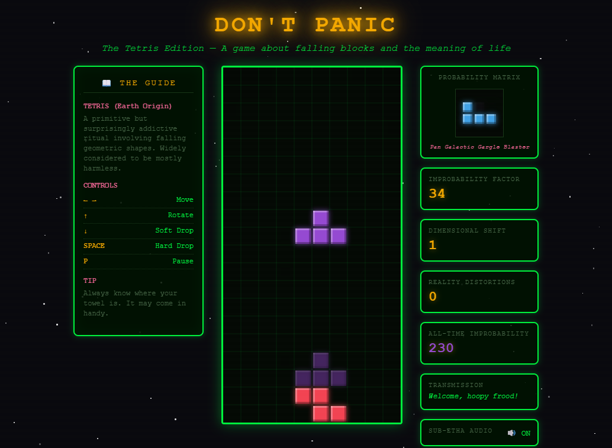

# 🎮 DON'T PANIC: The Tetris Edition

*A Hitchhiker's Guide to the Galaxy themed Tetris game*


## 🎮 [**PLAY NOW**](https://christopherwampler.github.io/tetris) 🎮

👉 **[https://christopherwampler.github.io/tetris](https://christopherwampler.github.io/tetris)** 👈


## About

**DON'T PANIC: The Tetris Edition** is a fully-featured Progressive Web App that brings classic Tetris gameplay to life with a nostalgic CRT terminal aesthetic, inspired by Douglas Adams' "The Hitchhiker's Guide to the Galaxy."

This learning project showcases modern web development techniques—combining a standalone HTML5 Canvas game with mobile-first design, PWA capabilities, and a simple Node.js/Express backend. Play instantly in your browser, or install it as a native-like app on your iPhone or Android device.

**Perfect for:** Tetris enthusiasts, retro gaming fans, and developers learning HTML5 Canvas, PWA development, or TypeScript.

### Features

- 🌌 Animated starfield background
- 💚 CRT scanline effects and retro green terminal styling
- 🎮 Full Tetris mechanics (rotation, scoring, progressive levels)
- 📱 Mobile-responsive touch controls
- 🔊 Sound effects toggle
- 💾 Local high score persistence
- ⌨️ Keyboard controls: Arrow keys, Space (hard drop), P (pause), R (restart)
- 🎨 HHGG-themed piece names and messages
- 📱 **Progressive Web App (PWA) - installable on iPhone/Android**
- 📱 **Advanced mobile controls with swipe gestures**
- 📳 **Haptic feedback for immersive gameplay**
- 🎨 **Responsive design with dynamic sizing**
- 🔒 **iOS safe area support (notch/Dynamic Island)**

## Screenshots

### Main Gameplay

*Classic Tetris gameplay with the Hitchhiker's Guide theme*

### More Action

*Showing score progression and different colored pieces*

## Quick Start

### 🌐 Play Online (Easiest Way!)

**Just visit:** [https://christopherwampler.github.io/tetris](https://christopherwampler.github.io/tetris)

No installation, no download - just click and play!

### 💻 Play Locally

Download `hitchhikers-tetris.html` or `index.html` from this repository and open it in your browser - no server needed!

### Run with Node.js Backend (Learning Project)

1. **Install Node.js 20+**
   Download from [nodejs.org](https://nodejs.org/)

2. **Clone the repository**
   ```bash
   git clone https://github.com/ChristopherWampler/tetris.git
   cd tetris
   ```

3. **Install dependencies**
   ```bash
   npm install
   ```

4. **Build and start the server**
   ```bash
   npm run build
   npm start
   ```

5. **Visit** http://localhost:3000
   The server provides a simple API endpoint. To play the game, open `hitchhikers-tetris.html` in your browser.

### Run with Docker

```bash
docker-compose up
```

Then visit http://localhost:3000

## Project Structure

```
tetris/
├── index.html                     # Main game file (PWA-enabled, GitHub Pages)
├── hitchhikers-tetris.html        # Standalone version (same as index.html)
├── manifest.json                  # PWA manifest for installability
├── sw.js                          # Service worker for offline support
├── icons/                         # PWA icons (72x72 to 512x512)
│   ├── icon.svg                   # Source SVG icon
│   └── icon-*.png                 # Generated PNG icons
├── src/
│   └── index.ts                   # Simple Express server (learning project)
├── scripts/
│   └── generate-icons.js          # Automated icon generation script
├── docs/
│   └── screenshots/               # Game screenshots
├── package.json                   # Node.js dependencies
├── MOBILE_TEST_CHECKLIST.md       # QA checklist for mobile testing
├── Dockerfile                     # Docker configuration
├── docker-compose.yml             # Docker orchestration
└── README.md                      # You are here
```

## Development

This is a learning project! The game is a standalone HTML file, and the Express backend is for learning Node.js basics.

### Available Scripts

- `npm run build` - Compile TypeScript to JavaScript
- `npm run dev` - Watch mode for development (auto-recompiles on changes)
- `npm start` - Run the compiled server
- `npm run lint` - Check code quality with ESLint
- `npm run format` - Format code with Prettier
- `npm run generate-icons` - Generate PWA icon files from SVG source

### PWA Icon Generation

The project includes an automated icon generation script that creates all required PNG icons from the source SVG:

```bash
# Generate all PWA icons (72x72 through 512x512)
npm run generate-icons
```

**Requirements:**
- The script uses `sharp` (already in devDependencies)
- Source SVG: `icons/icon.svg`
- Output: `icons/icon-{size}x{size}.png`

**Alternative:** Use online tools if you prefer:
- [RealFaviconGenerator](https://realfavicongenerator.net/)
- [PWABuilder Image Generator](https://www.pwabuilder.com/imageGenerator)

### Development Conventions

- **Language:** TypeScript for the backend, vanilla JavaScript for the game
- **Linting:** ESLint with TypeScript support
- **Formatting:** Prettier for consistent code style
- **Editor Config:** Uses `.editorconfig` for consistent formatting across editors

## Technologies Used

**Game (Frontend):**
- HTML5 Canvas for rendering
- Vanilla JavaScript (no frameworks!)
- CSS3 (animations, flexbox, CRT effects)
- Web Audio API for sound effects
- localStorage for high score persistence

**Backend (Learning):**
- Node.js 20
- Express.js
- TypeScript
- Docker for containerization

## Game Controls

- **Arrow Left/Right** - Move piece horizontally
- **Arrow Up** - Rotate piece
- **Arrow Down** - Soft drop (faster descent)
- **Spacebar** - Hard drop (instant placement)
- **P** - Pause/Resume
- **R** - Restart (after game over)

## Mobile Controls

### Swipe Gestures
- **Swipe Left/Right** - Move piece
- **Swipe Up** - Rotate
- **Swipe Down** - Hard drop

### Touch Buttons
- **← →** - Move (hold to repeat)
- **↻** - Rotate
- **⬇** - Hard drop
- **⏸** - Pause
- **↻ TRY AGAIN** - Restart game (shown after game over on mobile)

### Installing as App (PWA)
**iPhone:**
1. Open in Safari
2. Tap Share → Add to Home Screen
3. Tap Add

**Android:**
1. Open in Chrome
2. Tap menu → Add to Home screen

### PWA Troubleshooting

**"Add to Home Screen" option not appearing?**
- **iOS:** Must use Safari browser (not Chrome/Firefox)
- **Android:** Must use Chrome browser
- **Both:** Ensure you're on HTTPS (works with localhost for testing)
- **Both:** Service worker must register successfully (check browser console)

**App not working offline?**
- Open the app once while online to cache assets
- Check that service worker is registered (DevTools → Application → Service Workers)

**Icons not showing?**
- Clear browser cache and reinstall
- For developers: Run `npm run generate-icons` to create icon files

### Haptic Feedback
Light tap on movement, pulse on rotation, buzz on drop, success pattern on line clears.
*Respects system Reduce Motion preferences*

## Contributing

This is a personal learning project, but feedback and suggestions are welcome! Feel free to open an issue if you find a bug or have an idea for improvement.

## License

MIT © 2025 Chris

See [LICENSE](LICENSE) for more information.

## Acknowledgments

- Inspired by "The Hitchhiker's Guide to the Galaxy" by Douglas Adams
- Classic Tetris game mechanics
- Built as a learning project to explore HTML5 Canvas, TypeScript, and Node.js

---

*"Don't Panic, and always know where your tetromino is."*
